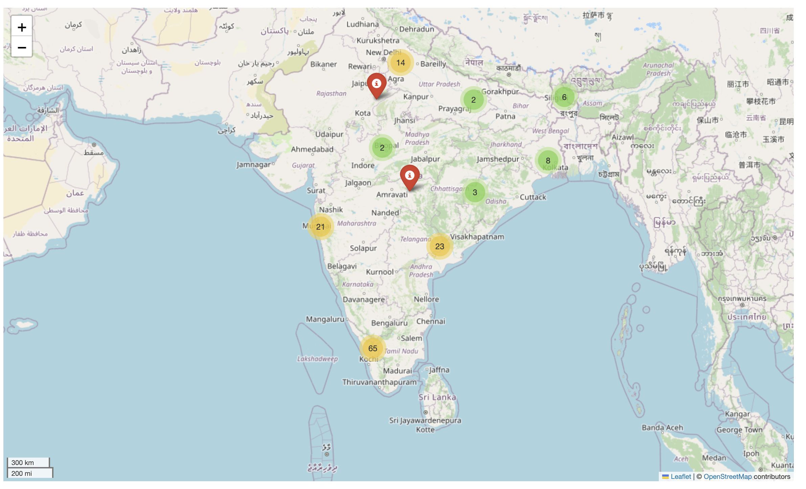
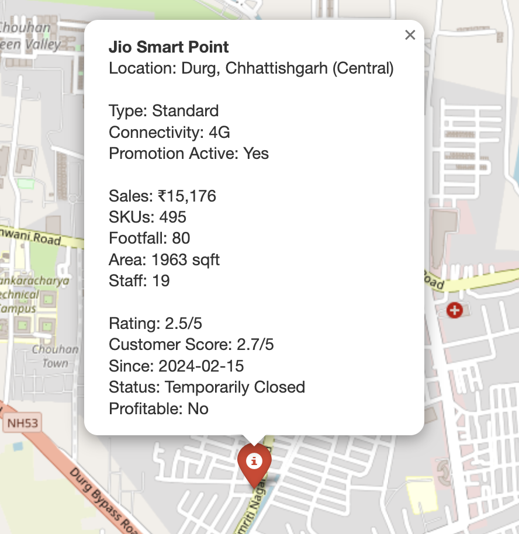

# Enterprise GIS Application: A GIS-based Retail Dashboard

This project presents a Geographic Information System (GIS)-based enterprise dashboard for the performance analysis of a large-scale offline retail network, using Reliance Jio's retail chain in India as a case study. The application integrates spatial data with business intelligence to provide enhanced operational insights and strategic decision-making support.

The project was developed as a term paper submission for the course **CE432: Geographical Information System (GIS)** at the **Indian Institute of Technology Kanpur** for the academic year 2024-25.

## Features

The dashboard provides a comprehensive suite of tools for visualizing and analyzing store performance, including:

* **Interactive Map**: A dynamic map powered by Folium that displays all retail store locations. Markers are color-coded based on profitability (green for profitable, red for non-profitable), with clustering to improve performance.

 

* **Store-Level Popups**: Clicking on a store marker reveals a popup with detailed information, including store name, location, sales value, footfall, ratings, and operational status.
* **Key Performance Indicators (KPIs)**: A summary section at the top of the dashboard displays aggregate metrics such as total number of stores, total sales, and the count of profitable stores.
 

* **Dynamic Visualizations**: A collection of interactive charts created with Plotly to visualize key business trends, including:
    * Sales by store category.
    * Profitability analysis by state.
    * Correlation between footfall and sales.
    * Distribution of customer ratings.
* **Top 20 Stores Table**: A detailed, sortable table listing the top 20 stores based on sales, allowing for granular performance analysis.
* **Data Ingestion**: Users can upload a GeoJSON file to explore their own geospatial retail data.

## Technology Stack

The dashboard is built using a modern, open-source technology stack:

* **Frontend**: The user interface is developed with **Gradio**, which simplifies the creation of web-based machine learning and data science dashboards.
* **Geospatial Libraries**:
    * **GeoPandas**: Used for geospatial data ingestion, processing, and enrichment, including mapping store coordinates to administrative boundaries (state and district).
    * **Folium**: Powers the interactive, leaflet-based map for visualizing store locations.
* **Data Visualization**:
    * **Plotly**: Generates dynamic and interactive charts and graphs for in-depth business analytics.
* **Data**: The project uses real geospatial data from **OpenStreetMap** (via Overpass Turbo) and a simulated, synthetic dataset for business metrics such as sales, footfall, and customer ratings.
* **Programming Language**: The entire application logic is written in **Python**.

## Data Source

* **Geospatial Data**: Acquired from OpenStreetMap using the Overpass Turbo API to extract locations tagged with "Jio".
* **Business Metrics**: Synthetic data was generated to simulate realistic business attributes for each store, including `sales`, `footfall`, `rating`, `staff_count`, and `is_profitable`. This approach was taken due to the unavailability of real-world operational data.

## Team

* **Shreya Gupta** (Roll No: 221027)
* **Saloni Mittal** (Roll No: 220942)
* **Varun Gupta** (Roll No: 221172)
